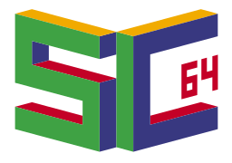
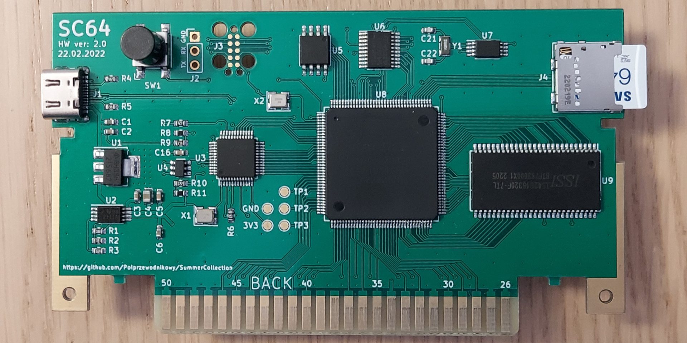
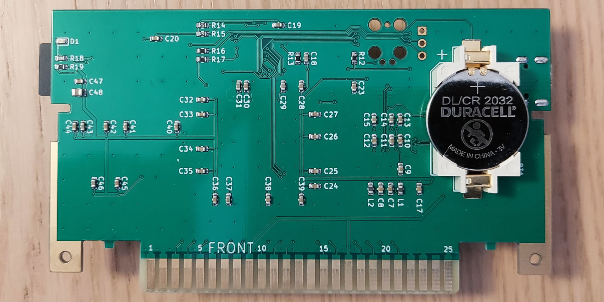

# SummerCart64 - a fully open source Nintendo 64 flashcart

## Features
 - 64 MiB SDRAM memory for game and save data
 - 16 MiB FLASH memory for bootloader and extended game data
 - 8 kiB on-chip buffer for general use
 - ~23.8 MiB/s peak transfer rate USB interface for data upload/download and debug functionality
 - ~23.8 MiB/s peak transfer rate SD card interface
 - EEPROM, SRAM and FlashRAM save types with automatic writeback to SD card
 - Battery backed real time clock (RTC)
 - Status LED and button for general use
 - 64DD add-on emulation
 - IS-Viewer 64 debug interface
 - N64 bootloader with support for IPL3 registers spoofing and loading menu from SD card
 - Enhanced [UltraCIC_C](https://github.com/jago85/UltraCIC_C) emulation with automatic region switching and programmable seed/checksum values
 - PC app for communicating with flashcart (game/save data upload/download, feature enable control and debug terminal)
 - [UNFLoader](https://github.com/buu342/N64-UNFLoader) support
 - Initial programming via UART header or dedicated JTAG/SWD interfaces
 - Software and firmware updatable via USB interface
 - 3D printable plastic shell

---

## Documentation

- [Quick startup guide](./docs/00_quick_startup_guide.md)
- [Memory map](./docs/01_memory_map.md)
- [N64 commands](./docs/02_n64_commands.md)
- [USB interface](./docs/03_usb_interface.md)
- [Config options](./docs/04_config_options.md)
- [FW and SW info](./docs/05_fw_and_sw_info.md)
- [Build guide](./docs/06_build_guide.md)

---

## Help / Q&A

For any questions related to this project, please use [*Discussions*](https://github.com/Polprzewodnikowy/SummerCart64/discussions) tab in GitHub repository.
Using discussions tab is highly encouraged as it allows to have centralized knowledge database accessible for everyone interested in this project.

I'm also active at [N64brew](https://discord.gg/WqFgNWf) Discord server as `korgeaux` but keep in mind that [*Discussions*](https://github.com/Polprzewodnikowy/SummerCart64/discussions) tab is a preferred option.

---

## How do I get one?

One option is to ask in `#summer-cart-64` channel on [N64brew](https://discord.gg/WqFgNWf) Discord server if someone is making a group order.

If you want to order it yourself then I've prepared all necessary manufacturing files on [PCBWay Shared Project](https://www.pcbway.com/project/shareproject/SC64_an_open_source_Nintendo_64_flashcart_14b9688a.html) site.
Full disclosure: for every order made through this link I will receive 10% of PCB manufacturing and PCB assembly service cost. This is a great way of supporting further project development.

If you don't need a physical product but still want to support me then check my [GitHub sponsors](https://github.com/sponsors/Polprzewodnikowy) page.

---

## High-level flashcart block diagram

---

## Finished example

---

## Acknowledgement

This project wouldn't be possible without these contributions:

- [64drive](https://64drive.retroactive.be) orders being on permanent hold long before creating this repository.
- [EverDrive-64 X7](https://krikzz.com/our-products/cartridges/ed64x7.html) being disappointment for homebrew development (slow USB upload, unjustified price and overcomplicated SD card access).
- [Jan Goldacker (@jago85)](https://github.com/jago85) and his projects:
  - [Brutzelkarte](https://github.com/jago85/Brutzelkarte_FPGA) providing solid base for starting this project and sparking hope for true open source N64 flashcarts.
  - [UltraCIC_C](https://github.com/jago85/UltraCIC_C) reimplementation for easy integration in modern microcontrollers. Thanks also goes to everyone involved in N64 CIC reverse engineering.
- [N64brew](https://discord.gg/WqFgNWf) Discord server community being very helpful during flashcart development.
- [FatFs](http://elm-chan.org/fsw/ff/00index_e.html) FAT32/exFAT library being easiest to integrate in embedded environment.
- [Yakumono's (@LuigiBlood)](https://twitter.com/LuigiBlood) extensive [64DD documentation](https://github.com/LuigiBlood/64dd/wiki) and its implementation in various emulators.
- [Libdragon](https://github.com/DragonMinded/libdragon) open source N64 SDK project and its developers.
