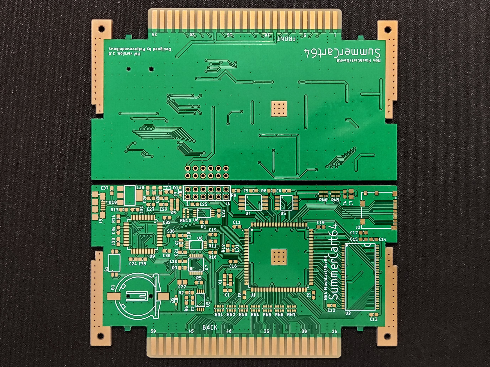

# SummerCollection

A collection of hardware, firmware and software designs of SummerCart64 - Nintendo 64 FlashCart/DevKit.

## Project parts

### Hardware

Folder **`hw`** contains PCB design made in Autodesk Eagle.

### Firmware

Folder **`fw`** contains firmware written in Verilog for Intel MAX10 FPGA.

### Software

Folder **`sw`** contains several helper programs that makes flash cart work all together, including bootloader and PC communication software.

## What works

Currently hardware implements basic functionality for playing games - ROM emulation, bootloader and PC communication. You can send any ROM to the SDRAM from PC and if game doesn't check for save hardware then it most likely will work. Bootloader does all the work necessary to setup the console registers for specific CIC chip that game requires.

## Issues

There are several issues with the project at the moment in order of importance:

- Documentation is not finished for most of the modules.
- No save hardware implementation.
- No SD card interface hardware implementation.
- No RTC hardware implementation.
- Currently PC communication disables N64 PI interface completely as there's no bus arbiter implemented.
- No save write-back to SD card hardware implementation.
- PCB schematic is unorganized and some component values are missing.
- There's no BOM for hardware.
- PCB design and necessary components needs to be reconsidered for next version.
- No CIC implementation in FPGA, current solution uses [UltraCIC II](https://github.com/perkinsb1024/UltraCIC-II) based on ATtiny45.

## What's next

Current goal is to implement EEPROM save emulation.

## Finished sample

