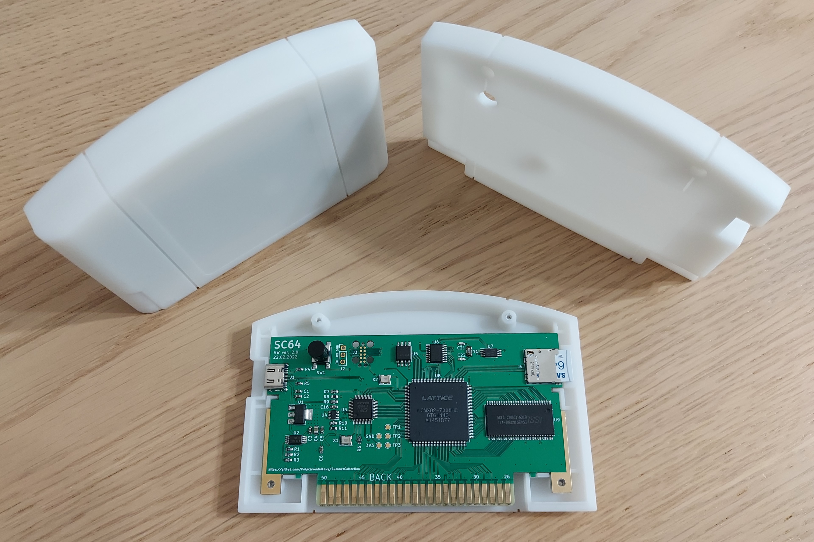

# SC64 - an open source Nintendo 64 flashcart

## Features
 - 64 MB SDRAM memory for game and save data
 - 16 MB FLASH memory for bootloader and extended game data
 - 8 kB on-chip buffer for general use
 - 25 MB/s peak transfer rate USB interface for data upload/download and debug functionality
 - 25 MB/s peak transfer rate SD card interface
 - EEPROM, SRAM and FlashRAM save types with automatic writeback to SD card
 - Battery backed real time clock (RTC)
 - Status LED and button for general use
 - 64DD add-on emulation
 - IS-Viewer 64 debug interface
 - Software and firmware update via USB interface
 - N64 bootloader with support for IPL2 registers spoofing and loading menu from SD card
 - Enhanced [UltraCIC_C](https://github.com/jago85/UltraCIC_C) emulation with automatic region switching and programmable seed/checksum values
 - PC app for communicating with flashcart (game/save data upload/download, feature enable control and debug console)
 - [UNFLoader](https://github.com/buu342/N64-UNFLoader) support

## High-level flashcart block diagram

## Finished sample

