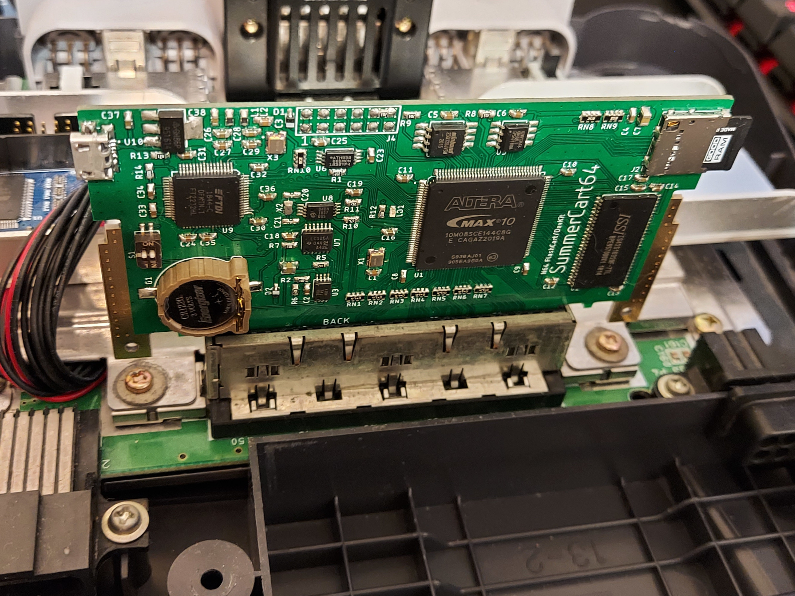

# SummerCollection

A collection of hardware, firmware and software designs of SummerCart64 - Nintendo 64 FlashCart/DevKit.

## Project parts

### Firmware

Folder **`fw`** contains firmware written in Verilog for Intel MAX10 FPGA.

### Hardware

Folder **`hw`** contains PCB design made in Autodesk Eagle.

### Software

Folder **`sw`** contains several helper programs that makes flash cart work all together, including bootloader and CIC emulation.

## What works

### **OLD STATUS, WILL BE UPDATED SOON**

~~Currently hardware implements basic functionality for playing games - ROM emulation, 4/16K EEPROM, bootloader and PC communication. You can send any ROM to the SDRAM from PC and if game doesn't check for save hardware other than EEPROM then it most likely will work. Bootloader does all the work necessary to setup the console registers for specific CIC chip that game requires.~~

## How to build

### **OLD INSTRUCTIONS, WILL BE UPDATED SOON**

~~Instructions below are mostly written for Windows users and point to Windows specific executables.~~

1. ~~Download latest zip files from [releases tab](https://github.com/Polprzewodnikowy/SummerCollection/releases).~~
2. ~~Order PCBs in your farovite company, all gerbers, bill of materials and schematics are in **`SummerCart64_PCB-[version].zip`** file.~~
3. ~~Order all necessary components, eg. in [Mouser](https://mouser.com/).~~
4. ~~Solder all components onto the PCB.~~
5. ~~Connect flashcart to PC.~~
6. ~~Download [FT_PROG](https://www.ftdichip.com/Support/Utilities.htm#FT_PROG) from FTDI website.~~
7. ~~Open FT_PROG and scan for devices.~~
8. ~~Load `ftdi-template.xml` from **`SummerCart64-[version].zip`** located in `hw` folder.~~
9. ~~Program FTDI chip, then right click on the device and select "Cycle port"~~
10. ~~Download and install [Arrow USB Blaster drivers](https://shop.trenz-electronic.de/en/Download/?path=Trenz_Electronic/Software/Drivers/Arrow_USB_Programmer/Arrow_USB_Programmer_2.4) from Trenz Electronic website.~~
11. ~~Download and install [QuartusProgrammer](https://download.altera.com/akdlm/software/acdsinst/20.1std/711/ib_installers/QuartusProgrammerSetup-20.1.0.711-windows.exe) from Intel website.~~
12. ~~Click on "Hardware Setup..." button and select "Arrow-USB-Blaster [AR*xxxxxx*]" in "Currently selected hardware", then close window.~~
13. ~~Click on "Auto Detect" button and select "10M08SC" option.~~
14. ~~Click on the newly shown row, then click on "Change File..." button and select `SummerCart64.pof` file from **`SummerCart64-[version].zip`** located in `fw/output_files` folder.~~
15. ~~Select "Program/Configure" and "Verify" checkboxes.~~
16. ~~Click on "Start" button and wait for operation to finish.~~
17. ~~Download and install avrdude.~~
18. ~~Program ATtiny45 with `UltraCIC-III.hex` file from **`SummerCart64-[version].zip`** located in `sw/cic` folder, more information is available [here](https://github.com/ManCloud/UltraCIC-III).~~
19. ~~Download latest release of [N64-UNFLoader](https://github.com/buu342/N64-UNFLoader).~~
20. ~~Insert flashcart in the Nintendo 64.~~
21. ~~Upload ROM by executing `UNFLoader -r your_rom_file.n64`~~
22. ~~Turn on console and enjoy playing homebrew games on real hardware.~~

## Issues

### **OLD STATUS, WILL BE UPDATED SOON**

~~There are several issues with the project at the moment in order of importance. Keep in mind that core flashcart functionality is fully working:~~

- ~~No save write-back to SD card without console reset implementation.~~

## What's next

Current goal is to rewrite README.md

## Finished sample (obsolete v1 version, to be replaced with v2)

